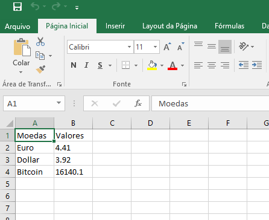

# Cambio com Python
Um script para pegar os valores, via requeisição web, das cotações das principais moedas mundiais:
  - Dollar
  - Euro
  - Bitcoin

API utilizada: [FIXER.IO](https://fixer.io/)

### Bibliotecas para Funcionamento do Script
``` sh
pip install requests
```
``` sh
pip install json
```
``` sh
pip install pandas
```

### Arquivo Gerado



### Desenvolvedor

 - Anderson Nogueira

License
----
**Free Software!** A documentação está armazenada [aqui](https://github.com/Anderson-Nogueira/cambio-moedas)